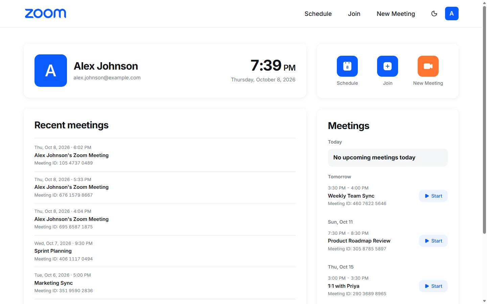
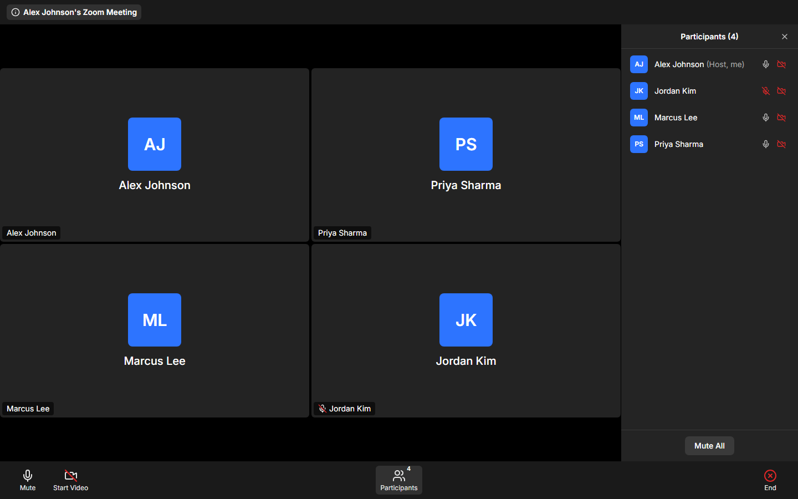
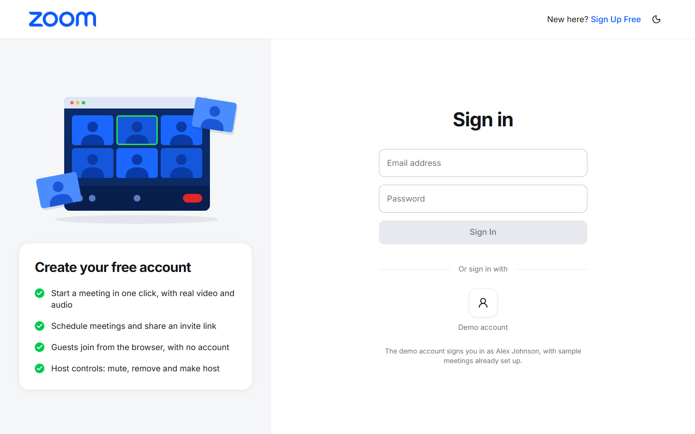

# Zoom Clone

A video-meeting web app modelled on Zoom. Sign in, start an instant meeting, schedule one for later, or join by meeting ID or invite link. Audio and video are real.

**Live app:** https://zoomclone.tarunj.in

To look around without signing up, choose **Demo account** on the sign-in page. It signs you in as a sample user with meetings already set up.

| | |
|---|---|
|  |  |
| Dashboard | Meeting room, as the host sees it (cameras off) |



## Contents

- [Features](#features)
- [Tech stack](#tech-stack)
- [How it fits together](#how-it-fits-together)
- [Run it locally](#run-it-locally)
- [Project structure](#project-structure)
- [Database](#database)
- [How access works](#how-access-works)
- [Tests and CI](#tests-and-ci)
- [Deployment](#deployment)
- [Assumptions](#assumptions)
- [Known limitations](#known-limitations)

## Features

**Core**

| Feature | What you get |
|---|---|
| **Dashboard** | New Meeting, Join and Schedule in the navbar and as tiles; a profile card with a live clock; Upcoming and Recent lists; an account menu with Profile, Settings and Sign out. |
| **Instant meeting** | One click creates a meeting with a unique 11-digit ID, a passcode and an invite link, and takes you into it. |
| **Join** | By meeting ID and passcode, or by invite link. You enter a display name first. Unknown IDs are rejected with "Invalid meeting ID". |
| **Schedule** | Topic, description, date and time, duration and video defaults. The meeting is saved, listed under Upcoming, and has a details page with "Copy Invitation". |
| **Meeting room** | Camera and mic preview before joining, a gallery grid, mute and video toggles, a participants panel, and meeting info with the invite link. |

**Beyond the core**

- **Accounts.** Sign up, sign in and sign out. Guests still join meetings without an account.
- **Host controls.** Mute everyone, mute one person by clicking their microphone, remove someone, make someone else host, end the meeting for all.
- **One host at a time.** A host who leaves picks who takes over ("Assign a new host"). If the host just closes the tab or their browser crashes, a successor is chosen automatically.
- **Scheduled meetings start with their owner.** Someone who arrives early sees "Waiting for the host to start this meeting" and is let in automatically when it starts.
- **Responsive.** Phone, tablet and desktop layouts, with light and dark mode.

## Tech stack

| Layer | Used |
|---|---|
| **Frontend** | Next.js 16 (App Router, single-page: every page is a client component), React 19, TypeScript, Tailwind CSS 4 |
| **Calls in the browser** | `livekit-client` and the hooks from `@livekit/components-react`. Every visible control is this app's own. |
| **Backend** | Python 3.14, FastAPI, SQLAlchemy 2, Pydantic 2 |
| **Database** | SQLite (WAL mode) |
| **Media** | LiveKit Cloud, a selective forwarding unit (SFU): it relays each person's audio and video to everyone else |
| **Tests and CI** | pytest; TypeScript, ESLint and the production build; GitHub Actions |
| **Hosting** | Vercel (client), Railway (server, with a volume for the database) |

## How it fits together

```
 Browser (Next.js) ── REST ──▶ FastAPI ── admin API ──▶ LiveKit Cloud
        │                        │                           ▲
        │                      SQLite                        │
        └──────────── WebRTC audio and video ────────────────┘
```

The server never touches audio or video. It decides who may join and in what role, then hands the browser a signed LiveKit token. The browser connects to LiveKit directly with that token.

`PLAN.MD` covers the design in depth: the full schema, the meeting and host rules, every API route, and the reasoning behind them.

## Run it locally

You need Python 3.14, Node.js 24, and a free [LiveKit Cloud](https://cloud.livekit.io) project.

**1. Server**

```bash
cd server
python -m venv .venv
.venv\Scripts\activate            # macOS/Linux: source .venv/bin/activate
pip install -r requirements-dev.txt
copy .env.example .env            # macOS/Linux: cp .env.example .env
uvicorn app.main:app --reload --port 8000
```

Put your LiveKit project's URL, API key and API secret in `server/.env` (LiveKit Cloud → Settings → Keys). Without them the server still starts, and logs a warning, but nobody can connect to a call.

The database file is created and filled with sample data the first time the server starts. The API's interactive documentation is at http://localhost:8000/docs.

**2. Client**

```bash
cd client
npm install
copy .env.example .env.local      # macOS/Linux: cp .env.example .env.local
npm run dev
```

Open http://localhost:3000 and choose **Demo account**, or create your own.

**3. Try a call**

Start a meeting, open its invite link in a private window, and join there under another name. The private window is a guest, so you can see both sides: host controls in one, the attendee's view in the other.

### Settings

| File | Variable | What it is |
|---|---|---|
| `server/.env` | `LIVEKIT_URL`, `LIVEKIT_API_KEY`, `LIVEKIT_API_SECRET` | Your LiveKit project. |
| `server/.env` | `DATABASE_URL` | SQLite file. Defaults to `sqlite:///./zoom.db`. |
| `server/.env` | `CLIENT_ORIGIN` | The client's address, for CORS. Several are comma-separated. The first one is used to build invite links. |
| `client/.env.local` | `NEXT_PUBLIC_API_URL` | The server's address. It is baked in when the client is built. |

### Demo account

| Email | Password |
|---|---|
| `alex.johnson@example.com` | `zoomclone-demo` |

The password is public on purpose, so anyone can try the app. The demo account always has a few upcoming meetings; new accounts start empty.

## Project structure

```
client/                       Next.js app
└── src/
    ├── app/                  pages: login, dashboard, meetings/[number] (details),
    │                         j/[number] (invite link), wc/[number] (pre-join and room)
    ├── components/           auth/, dashboard/, meeting/, ui/
    └── lib/                  api.ts (one function per endpoint), auth.ts, types.ts, helpers

server/                       FastAPI app
├── app/
│   ├── routers/              auth.py, users.py, meetings.py   (thin: parse, call, respond)
│   ├── services/             auth, meetings, LiveKit, ID generation   (the rules)
│   ├── models.py             database tables
│   ├── schemas.py            request and response shapes
│   ├── database.py           engine, sessions, schema upgrades
│   └── seed.py               sample users and meetings
└── tests/

.github/workflows/ci.yml      checks on every push and pull request
PLAN.MD                       the design in depth
```

## Database

Four tables, created and upgraded automatically on startup.

| Table | Holds | Notes |
|---|---|---|
| `users` | Accounts | Unique email; the password as a salted scrypt hash. |
| `auth_tokens` | One row per sign-in | Only the SHA-256 of the token, and when it expires. |
| `meetings` | Instant and scheduled meetings | Belongs to a user (its owner). Unique 11-digit `meeting_number`, a passcode, a random `invite_token`, a status (`scheduled`, `live`, `ended`) and the schedule. |
| `meeting_participants` | One row per join | Belongs to a meeting, and to a user if they were signed in (guests have none). Holds the display name, the current role (`host` or `attendee`), the status (`joined`, `left`, `removed`) and the join and leave times. |

```
users 1───* auth_tokens
users 1───* meetings
users 1───* meeting_participants   (optional: guests have no account)
meetings 1───* meeting_participants
```

- Participants are separate from users so that guests can join, and so that rejoining is simply a new row. This table is what makes the Recent list possible, and it is where the host role lives.
- Allowed values are enforced with CHECK constraints. Foreign keys are enforced too, so deleting a meeting removes its participant rows.
- Times are stored in UTC and shown in the browser's time zone.

## How access works

There are three separate proofs, each for one job.

| Proof | Who has it | What it allows |
|---|---|---|
| **Account token** | A signed-in user | The dashboard: listing, creating and viewing your own meetings. Starting a meeting you own, which makes you its first host. |
| **Passcode or invite link** | Anyone the owner shared it with | Joining that meeting as an attendee. |
| **Participant secret** | One participant, for one join | Leaving, and the host controls while that participant is currently the host. |

- **Passwords** are stored as salted scrypt hashes.
- **Account tokens** are random strings sent as `Authorization: Bearer …`. The server keeps only their SHA-256 hash, they last 30 days, and signing out revokes them.
- **The invite link does not contain the passcode.** Its `?pwd=` value is a separate random token for that meeting. It lets the holder in, as the link is meant to, but the passcode cannot be worked out from it.
- **Host powers follow the participant's current role**, not the account. That is what lets "Make Host" work for a guest, and what removes the powers from someone who hands the role over.
- **Leaving needs the participant secret.** Participant IDs are visible to everyone in a call, so an ID alone must not be enough to make someone else "leave".

## Tests and CI

```bash
cd server
pytest
```

26 tests cover the API with LiveKit replaced by a fake: creating and listing meetings, who may join and who may start, host controls, the one-host rule and host succession (including a host who vanishes without leaving), accounts, and upgrading an older database.

```bash
cd client
npx tsc --noEmit && npm run lint && npm run build
```

The client has no unit tests. It is checked by the type checker, the linter, the production build, and by hand in the browser.

Both sets of checks run on GitHub for every push to `main` and every pull request (`.github/workflows/ci.yml`). They report on a commit; they do not hold back a deploy.

## Deployment

The client runs on Vercel (root directory `client`) and the server on Railway (root directory `server`, with a volume for the SQLite file). Both redeploy on every push to `main`.

- Set `NEXT_PUBLIC_API_URL` on Vercel before building.
- On Railway, set the three LiveKit variables, `CLIENT_ORIGIN` to the client's URL, and `DATABASE_URL` to a path on the volume.
- Run **one** server process. SQLite and the route design both assume it.
- The database upgrades itself on start and is never rebuilt, so data survives redeploys.

## Assumptions

- **"Assume a default user is logged in."** Login and signup are built (the brief lists them as a bonus), so the dashboard asks you to sign in. The demo account is the default user, one click from the sign-in page, and it comes with sample data.
- **Guests need no account.** Anyone with an invite link, or the meeting ID and passcode, can join.
- **Every meeting has a passcode,** generated with the meeting. The invite link lets you in without typing it.
- **Who can start a meeting.** Only its owner can start a scheduled meeting. An instant meeting can be opened by anyone who has its link.
- **When a meeting ends.** When the host ends it for everyone, or when the last person leaves. Its owner can start it again.
- **One host at a time,** as in Zoom without co-hosts. The role can be handed to anyone in the meeting, including a guest.
- **Media goes through LiveKit Cloud.** Building a media server was out of scope; the app's own logic is meetings, permissions and host controls.
- **Only working controls are shown.** Zoom features this app does not have (chat, screen share, reactions, plans and billing, and so on) are left off the screen, not shown as dead buttons.
- **Zoom's look is followed.** Layouts, colours and wording follow Zoom's web app and meeting window. The illustration on the sign-in page is drawn for this project.

